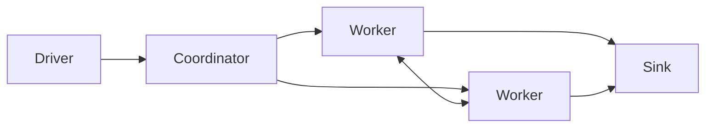

<p align="center">
  <h1 align="center">MoonWeave</h1>
</p>

<p align="center">
  <strong>Stateful streaming with causal order and durable distributed execution.</strong>
</p>

<p align="center">
  Causal events · Partitioned state · Event-time processing · Online recovery
</p>

MoonWeave is a distributed dataflow engine for jobs whose state must remain
correct when events arrive out of order, workers move, or a process restarts.
It keeps causal dependencies in the data model, compiles jobs into deterministic
partitioned plans, and makes recovery part of normal execution.

## Why MoonWeave

Most stream processors use arrival order as a practical approximation of event
order. MoonWeave keeps those two ideas separate. An event may depend on another
event that has not arrived yet; the dependent work waits until its causal
frontier is complete. The same state can then be replayed, checkpointed, moved
to another Worker, and resumed under a new assignment.

## Features

**Causal dataflow**

- Immutable events with explicit parent dependencies
- Causal frontiers, pending-event release, and duplicate suppression
- Replayable logs, snapshots, and state reclamation

**Distributed execution**

- Deterministic keyed partitioning and explicit exchange routes
- Multi-stage graphs with durable edges and downstream acknowledgement
- Coordinator-managed placement across independent Workers
- Versioned, statically registered operators with explicit state schemas

**Stateful streaming**

- Keyed aggregation with incremental state
- Event-time windows, watermarks, and allowed lateness
- Bounded interval joins with independent input sides
- Graph transforms, branching, and fan-in composition

**Operations**

- Durable pause, resume, drain, cancel, and status transitions
- Online rescaling with state migration and epoch fencing
- Compatible job updates that preserve running state
- Coordinator high availability and network failover

**Sources and sinks**

- Replayable event input
- JSON Lines and Kafka connectors
- Durable output records with stable idempotency keys
- At-least-once delivery semantics for external consumers

## A causal event stays causal

The public API does not turn transport order into application order:

```moonbit
import {
  "moonweave/moonweave/causal",
  "moonweave/moonweave/runtime/api" @flow,
}

let run = @flow.KeyedSumJob::new("orders").run_local()

let parent = @flow.KeyedSumEvent::new(
  @causal.EventId::new("orders", 0L),
  "account",
  10L,
)
let child = @flow.KeyedSumEvent::new_with_parents(
  @causal.EventId::new("orders", 1L),
  [parent.id()],
  "account",
  2L,
)

assert_eq(run.submit([child]), [])
assert_eq(run.submit([parent]), [
  @flow.KeyedSumUpdate::new("account", 10L),
  @flow.KeyedSumUpdate::new("account", 12L),
])
```

The child is retained until its parent is admitted. Once the frontier is
complete, both updates are emitted in causal order.

## Runtime shape



The Driver submits a job and controls its lifecycle. The Coordinator persists
job authority, assigns partitions, and coordinates recovery. Workers own task
state, process events, exchange partition data, and write checkpoints. A
rescale or restart changes the assignment only after the previous epoch has
been fenced and its durable state has been accounted for.

## Execution guarantees

Every compiled job carries a deterministic plan, operator identity, code
digest, runtime compatibility, input and output schemas, and state schema.
Workers execute only implementations registered in their binary, so a job
submission describes executable behavior without loading code dynamically.

Sources are replayable. Durable sinks record output before delivery and expose
a stable idempotency key for consumers retrying after a failure. MoonWeave
provides at-least-once delivery; an external transaction is only possible when
the sink supplies one.

## Explore the project

- [`runtime/api`](runtime/api) is the typed integration surface for jobs,
  graphs, connectors, and service control.
- [`causal`](causal) contains event identities, causal logs, frontiers, and
  snapshots.
- [`runtime/task`](runtime/task) contains deterministic task execution,
  windows, joins, and state validation.
- [`operator`](operator) contains the built-in aggregation, reachability, and
  security operators.
- [`cmd`](cmd) contains the Coordinator, Worker, and Driver entrypoints.
